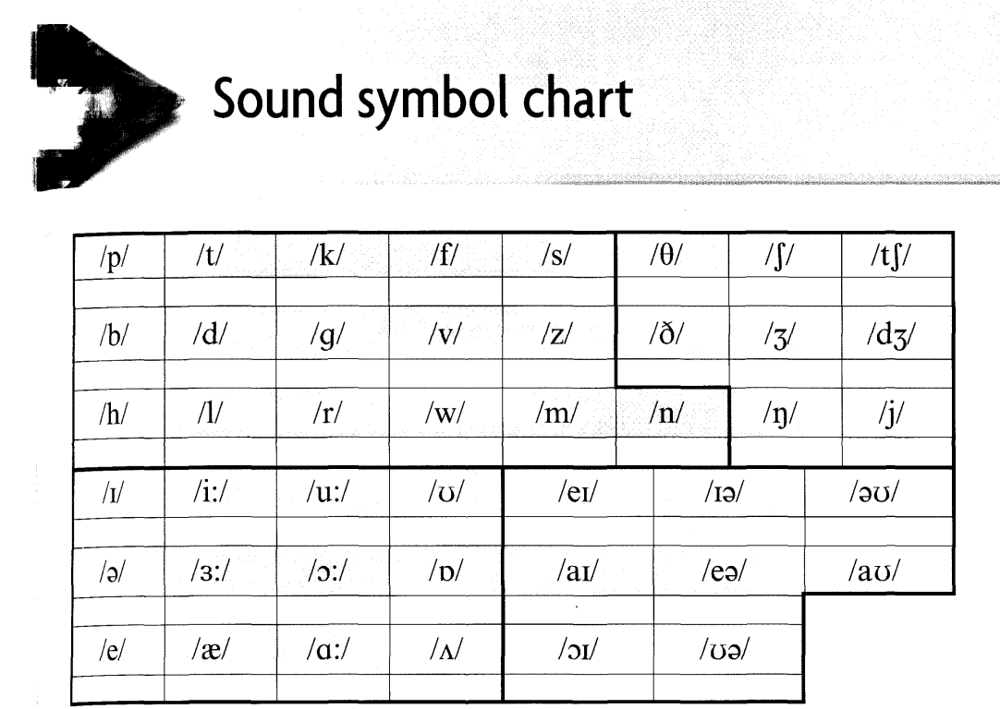

# English Sound Chart

An interactive IPA (International Phonetic Alphabet) sound symbol chart for English. Click any symbol that has audio to hear its pronunciation.



## Features

- Consonant and vowel IPA symbol grid
- Click-to-play audio for consonant sounds
- Responsive layout

## Development

```bash
npm install
npm run dev      # http://localhost:5173
npm run build    # type-check + production build
npm run preview  # preview the production build locally
```

## Deploy

```bash
npm run deploy   # builds and publishes to GitHub Pages
```

The app is served under the `/english-chart/` base path on GitHub Pages.

## Tech stack

- React 19 + TypeScript
- Vite 6
- No external UI libraries
